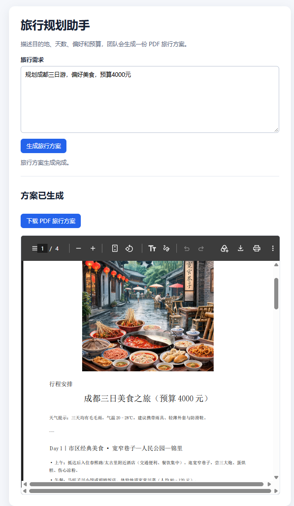

# Travel Multi-Agent

基于 LangGraph 的旅行规划多智能体应用。用户可以通过命令行或本地网页描述目的地、天数、偏好和预算；系统协作生成行程建议、语言沟通提示和旅行配图，最后输出并预览 PDF 旅行方案。

## 项目能力

- **旅行规划**：按天生成行程建议；旅行规划角色可按需查询实时天气。
- **语言建议**：生成目的地沟通、常用表达和礼仪提示。
- **旅行配图**：通过火山方舟豆包 Seedream 生成并保存旅行图片。
- **PDF 报告**：汇总各角色输出为 PDF，网页支持内联预览和下载。
- **调度保护**：监督者必须完成旅行规划、语言建议和视觉设计后，才能生成报告；错误的提前结束或重复路由会自动修正。
- **可观测性**：本地日志记录工作流、角色、路由和工具状态；可选启用 LangSmith 查看端到端 Trace。


## 工作流

```text
  → 监督者（Supervisor）
  → 旅行规划角色（可调用 Open-Meteo）
  → 语言顾问角色
  → 视觉设计角色（调用豆包图片生成）
  → PDF 报告角色
  → 网页预览 / 下载 PDF
```

## 技术栈

| 分类 | 技术                            | 用途 |
| --- |---------------------------------| --- |
| Agent 编排 | LangGraph、LangChain            | 单 Agent 工具循环与监督者多 Agent 工作流 |
| 大模型 | DeepSeek（OpenAI 兼容接口）     | 行程规划、路由与语言建议 |
| 天气数据 | Open-Meteo                      | 地点解析、当前天气与未来三日预报 |
| 图片生成 | 火山方舟 Ark、豆包 Seedream     | 生成旅行配图并保存至本地 |
| 文档生成 | ReportLab                       | 生成含中文和图片的 PDF 行程报告 |
| Web | 原生 HTML/CSS/JavaScript | 输入需求、查看和下载报告 |
| 监控 | logging、LangSmith              | 本地事件日志与远程链路追踪 |

## 目录说明

```text
app/                 应用配置、模型、Agent、Web 服务、日志与追踪
tools/               天气、图片生成、PDF 工具
web/                 浏览器页面静态资源
tests/               单元测试
images/              生成的旅行图片（运行产物）
output/pdf/          生成的 PDF（运行产物）
output/logs/         本地日志（运行产物）
```

## 启动方法

### 1. 创建虚拟环境并安装依赖

在项目根目录执行：

```powershell
python -m venv .venv
.\.venv\Scripts\Activate.ps1
pip install -r requirements.txt
```

### 2. 配置环境变量

首次使用时将 `.env.example` 复制为 `.env`，再填写密钥：

```powershell
Copy-Item .env.example .env
```

`.env` 示例：

```env
DEEPSEEK_API_KEY=你的 DeepSeek API Key
ARK_API_KEY=你的火山方舟 API Key

# 可选：启用 LangSmith 追踪
LANGSMITH_API_KEY=你的 LangSmith API Key
LANGSMITH_PROJECT=travel-multi-agent
LANGSMITH_TRACING=true
```

说明：

- `DEEPSEEK_API_KEY`：必填，用于模型调用。
- `ARK_API_KEY`：在需要生成图片时必填。
- `LANGSMITH_*`：可选；未填写时不上传 Trace，应用仍可正常运行。

### 3. 启动 Web 页面

```powershell
python run_web.py
```

浏览器访问 [http://127.0.0.1:5000](http://127.0.0.1:5000)。提交需求后，等待工作流完成，即可在页面中预览和下载 PDF。
